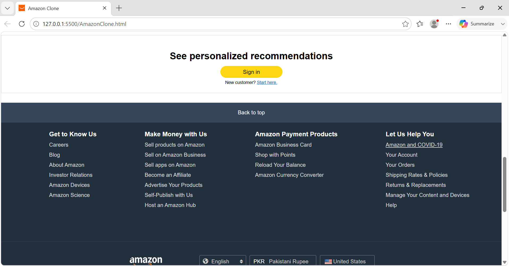
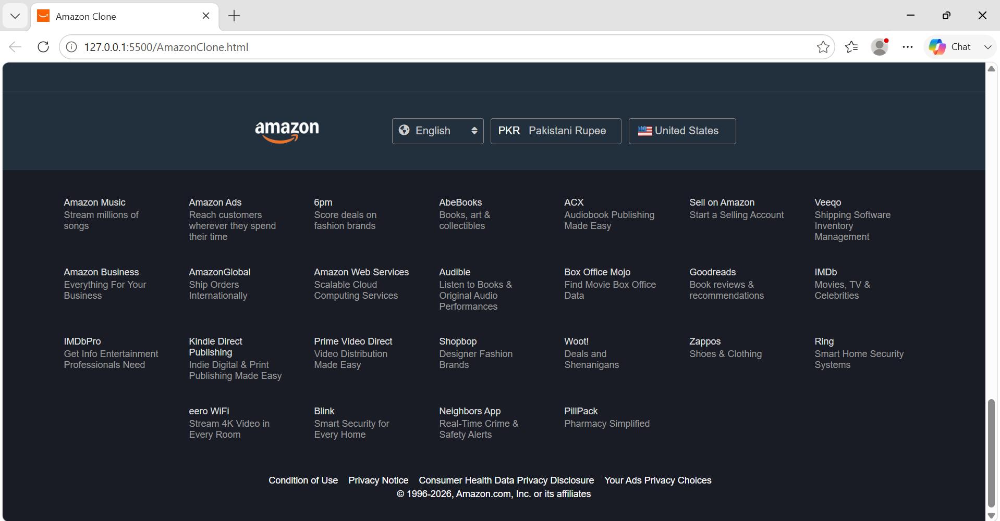

# 🛒 Amazon Clone

A pixel-perfect front-end clone of the Amazon website built with pure **HTML5** and **CSS3** — no frameworks, no JavaScript libraries, just clean hand-written code.

---

## 📸 Screenshots

### 🔝 Homepage — Navbar & Hero Section


### 🛍️ Sign In Section


### 🦶 Footer — Sub-brands & Links


---

## ✨ Features

- ✅ Fully responsive **Navbar** with logo, search bar, location, cart & sign-in
- ✅ **Navigation Panel** with category links (Today's Deals, Prime Video, etc.)
- ✅ **Hero Banner** with location redirect message
- ✅ **Product Category Grid** — 8 cards (Health, Gaming, Scooter, Samsung, Toys, Clothes, Pet Care, Beauty)
- ✅ **Sign-In / Sign-Up** call-to-action section
- ✅ **Detailed Footer** with 4-column links, language/currency selector, and 25 Amazon sub-brands
- ✅ Hover effects on nav items, panel links, and footer links
- ✅ Font Awesome icons integrated (location dot, magnifying glass, cart, globe)
- ✅ Pakistan-localized (PAK region, PKR currency, Pakistan delivery)

---

## 🛠️ Tech Stack

| Technology | Usage |
|-----------|-------|
|  | Page structure & semantics |
|  | Styling, layout (Flexbox), hover effects |
|  | Icons (cart, search, location, globe) |

---

## 📁 Project Structure

```
amazon-clone/
│
├── index.html               # Main HTML file
├── AmazonClone.css          # Main stylesheet
│
├── screenshot-navbar.png    # Screenshot — Navbar & Hero
├── screenshot-signin.png    # Screenshot — Sign In section
├── screenshot-footer.png    # Screenshot — Footer
│
├── Amazon-logo.png          # Amazon navbar logo
├── Country logo.jpeg        # Pakistan flag
├── Hero-image.png           # Hero banner background
├── america logo.jpg         # US flag (footer)
├── logo.jpg                 # Favicon
│
├── Health.png               # Category card image
├── Game.png                 # Category card image
├── Electric Scooter.png     # Category card image
├── Box1.png                 # Samsung S23 Ultra image
├── Box2-Picsart-AiImageEnhancer.png  # Toys image
├── towel.jpg                # Clothes image
├── Box4.png                 # Pet Care image
└── Porlur.png               # Beauty image
```

---

## 🚀 Getting Started

### 1. Clone the repository

```bash
git clone https://github.com/your-username/amazon-clone.git
```

### 2. Navigate into the project

```bash
cd amazon-clone
```

### 3. Open in your browser

Just open `index.html` directly in any browser — no server or setup needed!

```bash
# On Windows
start index.html

# On macOS
open index.html

# On Linux
xdg-open index.html
```

---

## 🎨 UI Highlights

- **Navbar** background: `#0f1111` (Amazon's signature dark tone)
- **Search bar** accent: `#febd68` (Amazon orange)
- **Panel** background: `#222f3d`
- **Sign-in button**: `#FFD814` (Amazon yellow)
- **Footer** base: `#191c25`
- Smooth hover borders on all interactive navbar & panel elements

---

## 📌 What I Learned

- Structuring complex layouts using **CSS Flexbox**
- Working with `flex-wrap` for responsive grid-like sections
- Using `background-image` with `background-size: cover` for image cards
- Integrating **Font Awesome 7** via CDN
- Replicating real-world UI with attention to spacing, color, and typography
- Organizing a multi-section HTML page (header → content → footer)

---

## 🔮 Future Improvements

- [ ] Add **JavaScript** for cart functionality
- [ ] Make the site fully **responsive** for mobile screens
- [ ] Add a **product detail page**
- [ ] Implement a **search feature**
- [ ] Deploy using **GitHub Pages**

---

## 👨‍💻 Author

**Hiten**
📍 FAST-NUCES Karachi | Computer Engineering Student

[](https://linkedin.com/in/your-profile)
[](https://github.com/your-username)

---

## 📄 License

This project is open-source and available under the [MIT License](LICENSE).

> ⭐ If you found this helpful, drop a star on the repo — it means a lot!
